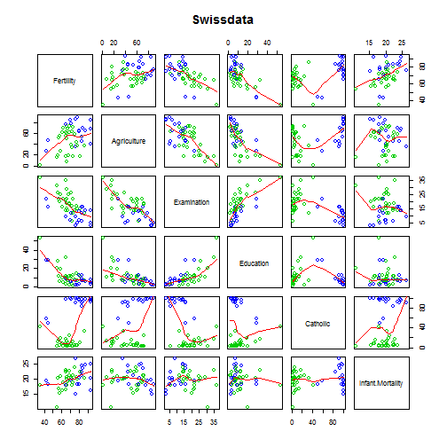

---
title       : Practicando R
subtitle    : Inicio
author      : Arturo Chian
job         : UNMSM
--- .nobackground .quote

<q>R es lo máximo.</q>

--- #rchartssite

 

--- &interactive2 height:100

<a class='example'>NVD3</a>

<textarea class='interactive' id='interactive{{slide.num}}' data-cell='{{slide.num}}' data-results='asis' style='display:none'>swiss$Infant.Mortality2<-cut2(swiss$Infant.Mortality,g=2)
qplot(Agriculture, Fertility, data = swiss, geom = c("point", "smooth"),
method = "lm", shape=Infant.Mortality2)</textarea>

--- .segue .nobackground

## Thank You

